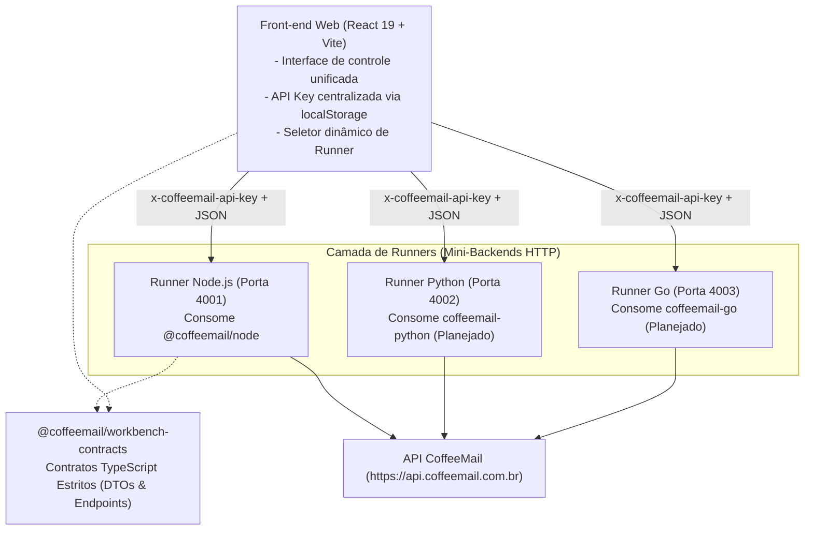

# CoffeeMail SDK Workbench

Bancada de testes, validação funcional e auditoria multiplataforma para os SDKs oficiais da **CoffeeMail**, desenvolvida sob os princípios de **Spec-Driven Development (SDD)**, **Clean Code** e **SOLID**.

---

## 🎯 Finalidade do Projeto

O **CoffeeMail SDK Workbench** foi criado para resolver um problema recorrente: a dificuldade de testar exaustivamente todas as funcionalidades de uma biblioteca cliente (SDK) em um ambiente controlado, realista e agnóstico de linguagem.

### Principais Objetivos:
- **Testabilidade Total de Features**: Fornecer uma interface visual simples e funcional para executar 100% dos métodos e fluxos do SDK (envios, domínios, templates, audiências, supressões, webhooks, estatísticas e introspecção).
- **Arquitetura Multi-Runner Desacoplada**: Permitir que **uma única interface web** em React teste implementações do SDK em qualquer linguagem (Node.js, Python, Go, Java) apenas alternando o runner de destino no cabeçalho.
- **Auditoria de DX (Developer Experience)**: Validar ergonomia de tipos, envelopes de retorno seguro `{ data, error }`, consistência de respostas e tempos de execução dos SDKs antes de cada publicação oficial no gerenciador de pacotes (npm, PyPI, etc.).
- **Zero Redundância de Credenciais**: A **API Key** é gerenciada centralmente no Front-end (com persistência em `localStorage`) e repassada sob demanda para os runners via header HTTP `x-coffeemail-api-key`. Os backends dos runners são estéreis e não exigem chaves em arquivos `.env`.

---

## 🏛️ Arquitetura da Solução

O monorepo utiliza **pnpm workspaces** e organiza-se em três camadas isoladas:



### Estrutura de Diretórios

```text
coffee-mail-sdk-workbench/
├── specs/                          # Especificação SDD da Runner API
│   ├── SPEC.md                     # Requisitos arquiteturais, fluxos e contratos funcionais
│   ├── openapi.json                # Especificação OpenAPI 3.1 padronizada
│   └── DX_EVOLUTION_SPEC.md        # Especificação de melhorias e ergonomia do SDK
├── packages/
│   └── contracts/                  # Pacote de DTOs TypeScript estritos compartilhados
├── backends/
│   └── runner-node/                # Runner Express que instancia e executa o @coffeemail/node
└── apps/
    └── web/                        # Interface funcional (React 19, CSS Moderno, sem Tailwind)
```

---

## 🧩 Recursos e Módulos Disponíveis

| Módulo | Ações Disponíveis | Funcionalidades Validadas no SDK |
| :--- | :--- | :--- |
| **Introspecção** | Consultar Chave | Valida integridade da chave, ambiente (`live`/`test`) e lista de permissões (`scopes`). |
| **E-mails** | Envio e Histórico | Disparo transacional com HTML/texto e listagem com status de entrega. |
| **Domínios** | Cadastro, DNS e Saúde | Criação de domínios, geração de registros DNS, disparo de verificação e diagnóstico de reputação. |
| **Modelos** | Criação e Preview | Cadastro de templates HTML e renderização de pré-visualização. |
| **Audiências** | Listas e Contatos | Criação de audiências, adição de contatos e listagem de inscritos. |
| **Supressões** | Listar, Adicionar, Remover | Controle de bloqueios de envio (bounces, reclamações e descadastros). |
| **Webhooks** | Listar, Criar e Testar | Configuração de endpoints para escuta de eventos e envio de payloads de teste. |
| **Estatísticas** | Consulta de Métricas | Agregação de totais (enviados, entregues, bounces) por intervalo de datas. |

---

## 🚀 Como Executar

### Pré-requisitos
- **Node.js** >= 18.0.0
- **pnpm** >= 9.0.0

### 1. Instalação das Dependências
Na raiz do monorepo:
```bash
pnpm install
```

### 2. Inicialização dos Serviços

#### Opção A: Executar Todo o Ambiente (Recomendado)
Inicia o backend (Runner Node na porta 4001) e o frontend (Vite na porta 5173) simultaneamente:
```bash
pnpm run dev
```

#### Opção B: Executar os Serviços Separadamente
- **Apenas o Runner Node**:
  ```bash
  pnpm run dev:backend
  ```
- **Apenas a Interface Web**:
  ```bash
  pnpm run dev:web
  ```

---

## 💻 Como Usar a Interface

1. **Acesse a Aplicação**: Abra [http://localhost:5173](http://localhost:5173) no seu navegador.
2. **Defina a sua API Key**: No cabeçalho superior, cole a sua chave do CoffeeMail (`cm_live_...` ou `cm_test_...`). A chave é salva automaticamente no `localStorage` do seu navegador.
3. **Verifique o Status do Runner**: O indicador no canto superior direito deve exibir **"Runner Conectado"** (com tempo de resposta e versão do SDK).
4. **Execute Operações**:
   - Navegue pelas abas (**Introspecção**, **E-mails**, **Domínios**, etc.).
   - Preencha os campos do formulário e clique em **"Executar no SDK"**.
   - Acompanhe o resultado no painel **"Retorno da Operação (SDK Payload)"**, que exibe o payload JSON real devolvido pelo SDK, tempo de execução e status.

---

## 🛠️ Scripts Disponíveis

Todos os comandos devem ser executados a partir da raiz do monorepo:

- **`pnpm run dev`**: Inicia todos os workspaces em modo de desenvolvimento com hot-reload.
- **`pnpm run build`**: Compila todos os pacotes (`contracts`, `runner-node` e `apps/web`).
- **`pnpm run typecheck`**: Executa a verificação estrita de tipos TypeScript (`tsc --noEmit`) em todos os projetos.
- **`pnpm run test`**: Roda a suíte completa de testes unitários com **Vitest**.

---

## 🔌 Adicionando um Novo Runner (ex: Python, Go ou Java)

Para adicionar suporte ao SDK de outra linguagem:

1. **Criar a Pasta do Runner**:
   Crie `backends/runner-<linguagem>` (ex: `backends/runner-python`).
2. **Implementar a Especificação**:
   Implemente os endpoints HTTP definidos rigorosamente em [`specs/openapi.json`](file:///Users/joaoneto/Developer/SaaS/coffee-mail-sdk-workbench/specs/openapi.json) (prefixados em `/api/v1/*`).
3. **Extrair a API Key do Header**:
   Seu backend deve extrair o header `x-coffeemail-api-key` para instanciar o SDK dinamicamente por requisição.
4. **Configurar a Porta**:
   Defina a porta no seu runner (ex: `4002` para Python, `4003` para Go).
5. **Cadastrar no Front-end**:
   Adicione o novo runner na constante `DEFAULT_RUNNERS` em [apps/web/src/constants/ui-strings.ts](file:///Users/joaoneto/Developer/SaaS/coffee-mail-sdk-workbench/apps/web/src/constants/ui-strings.ts).

O Workbench passará a testar o novo SDK instantaneamente, sem necessidade de alterações estruturais na interface.
