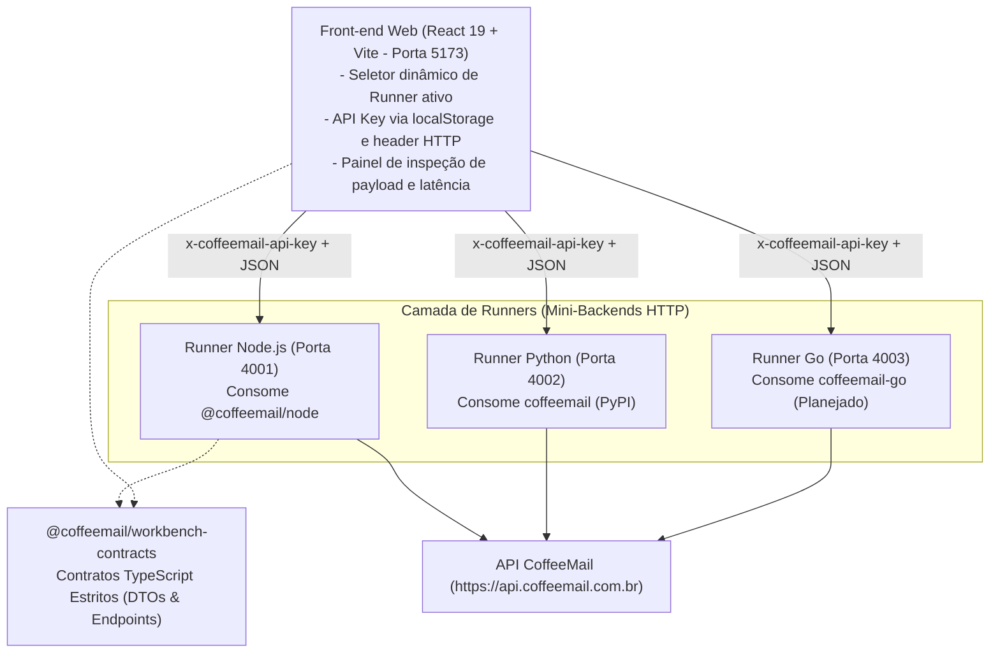

<div align="center">

# 🧪 CoffeeMail SDK Workbench

**Bancada de testes, validação funcional e auditoria multiplataforma para os SDKs oficiais da CoffeeMail**

[](https://pnpm.io)
[](https://www.typescriptlang.org)
[](https://react.dev)
[](./specs/openapi.json)
[](./LICENSE)

[Finalidade](#-finalidade-do-projeto) · [Arquitetura dos Runners](#-arquitetura-multi-runner) · [Como Executar](#-como-executar) · [Módulos Testados](#-recursos-e-módulos-validados) · [Novos Runners](#-adicionando-um-novo-runner)

</div>

---

## 🎯 Finalidade do Projeto

O **CoffeeMail SDK Workbench** é uma bancada de auditoria desenvolvida sob a metodologia **Spec-Driven Development (SDD)**. Ele permite validar o comportamento funcional, consistência e ergonomia de desenvolvedor (DX) dos SDKs oficiais da CoffeeMail em qualquer linguagem antes de publicações em gerenciadores de pacotes (npm, PyPI, etc.).

### Principais Benefícios:
- **Interface Visual Única**: Um único painel web em React 19 testa múltiplos SDKs apenas alternando o runner ativo.
- **Validação de Conformidade**: Garante que o retorno seguro `{ data, error }`, o mapeamento de exceções e a tipagem respeitem a especificação OpenAPI 3.1.
- **Backends Desacoplados e Sem Estado**: Os runners não armazenam credenciais nem arquivos `.env`. A **API Key** é gerenciada exclusivamente no navegador e enviada dinamicamente via cabeçalho HTTP `x-coffeemail-api-key`.
- **Métricas Reais de Execução**: Apresenta em tempo real a latência de chamada do SDK e o payload JSON bruto de resposta.

---

## 🏛️ Arquitetura Multi-Runner

O monorepo utiliza **pnpm workspaces** e distribui responsabilidades entre quatro camadas:



### Estrutura de Diretórios

```text
coffee-mail-sdk-workbench/
├── specs/                          # Especificação SDD da Runner API
│   ├── SPEC.md                     # Requisitos arquiteturais, fluxos e contratos
│   ├── openapi.json                # Especificação OpenAPI 3.1 padronizada
│   └── DX_EVOLUTION_SPEC.md        # Diretrizes de evolução de ergonomia
├── packages/
│   └── contracts/                  # DTOs TypeScript estritos compartilhados
├── backends/
│   ├── runner-node/                # Runner Express (Porta 4001) consumindo @coffeemail/node
│   └── runner-python/              # Runner FastAPI (Porta 4002) consumindo coffeemail (Python)
└── apps/
    └── web/                        # Interface de controle (React 19 + Vite - Porta 5173)
```

---

## 🧩 Recursos e Módulos Validados

| Aba | Ações Validadas | Funcionalidades Exercitadas nos SDKs |
| :--- | :--- | :--- |
| **Introspecção** | Consultar Chave | Valida integridade da API Key, ambiente (`live` ou `test`) e escopos autorizados |
| **E-mails** | Envio e Histórico | Disparo transacional com HTML/texto e consulta de status de entrega |
| **Domínios** | Cadastro, DNS e Saúde | Criação de domínios, exibição de registros DNS, verificação e diagnóstico de reputação |
| **Modelos** | Criação e Preview | Cadastro de templates e renderização em tempo real via sandbox |
| **Audiências** | Listas e Contatos | Criação de audiências, inclusão de contatos e listagem de subscritos |
| **Supressões** | Listar, Adicionar, Remover | Bloqueios e desbloqueios de envio (bounces permanentes e descadastros) |
| **Webhooks** | Listar, Criar e Testar | Registro de endpoints, envio de evento de teste e rotação de chave de assinatura |
| **Estatísticas** | Consulta de Métricas | Agregação de totais (enviados, entregues, bounces) por intervalo de datas |

---

## 🚀 Como Executar

### Pré-requisitos
- **Node.js** `>= 18`
- **pnpm** `>= 9`
- **Python** `>= 3.10` (para execução do Runner Python)

### 1. Instalar Dependências
Na raiz do monorepo:

```bash
pnpm install
```

### 2. Executar o Ambiente

#### Iniciar todos os serviços simultaneamente (Recomendado)
Inicia o **Runner Node (:4001)**, o **Runner Python (:4002)** e a **Interface Web (:5173)** em paralelo:

```bash
pnpm run dev
```

#### Iniciar serviços individualmente
- **Apenas o Runner Node.js**:
  ```bash
  pnpm run dev:backend
  ```
- **Apenas o Runner Python**:
  ```bash
  pnpm run dev:runner-python
  ```
- **Apenas a Interface Web**:
  ```bash
  pnpm run dev:web
  ```

---

## 💻 Como Usar a Interface

1. **Acesse a Aplicação**: Abra `http://localhost:5173` no navegador.
2. **Defina a API Key**: Cole sua chave do CoffeeMail (`cm_live_...` ou `cm_test_...`) no cabeçalho. Ela será salva no `localStorage` do seu navegador.
3. **Selecione o Runner**: Alterne entre o **Node.js Runner (Porta 4001)** e o **Python Runner (Porta 4002)** para validar comportamentos comparativos.
4. **Execute Ações**: Navegue pelas abas, preencha os formulários e clique em **"Executar no SDK"**.
5. **Inspecione o Retorno**: O painel exibe o tempo de resposta e o payload bruto devolvido pelo SDK.

---

## 🛠️ Scripts do Monorepo

```bash
# Iniciar todos os workspaces em desenvolvimento
pnpm run dev

# Compilar todos os pacotes (contracts, runners e web)
pnpm run build

# Executar checagem estrita de tipos TypeScript
pnpm run typecheck

# Executar testes unitários
pnpm run test
```

---

## 🔌 Adicionando um Novo Runner (ex: Go ou Java)

Para adicionar um novo runner ao ecossistema do Workbench:

1. Crie o diretório em `backends/runner-<linguagem>` (ex: `backends/runner-go`).
2. Implemente os endpoints HTTP definidos rigorosamente na especificação [`specs/openapi.json`](./specs/openapi.json) (prefixados em `/api/v1/*`).
3. Extraia o cabeçalho `x-coffeemail-api-key` em cada requisição para instanciar o cliente do SDK dinamicamente.
4. Configure a porta de execução (ex: `4003` para Go).
5. Cadastre o novo runner na constante `DEFAULT_RUNNERS` em `apps/web/src/constants/ui-strings.ts`.

---

## 📄 Licença

Software proprietário. Todos os direitos reservados à equipe **CoffeeMail**.
